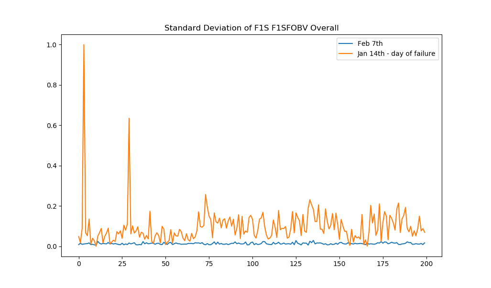

## nov-6-2018
- raw data density plots for inboard/outboard vibrations of all datasets, with outliers greater than 2 standard deviations removed: ['1-1-17', '1-7-17', '1-16-17', '2-7-17', 'failure-14th']  

   
- **January 16th** in bearing vibration ~100 times higher than usual... causing density plots to look weird. Motor plots look great tho.
- Same with **Jan 7th** out bearing vibration, there is a half hour stretch that is ~10-100 times times than usual, causing density plot to look weird.  

 

  
- It is more obvious in the bar plots that something is throwing off the vibration signals on those days.

- so for now we will work with these three datasets only. Jan 1st, Feb 7th, and the day of failure, the 14th.

## nov-7-2018

- standard deviations for bearing vibrations

- getting bad results so far... options to try:
    - autoencoders
    - frequency analysis
    - use somtf.py and modify it yourself so you have more control... because i dont really understand the other implementation and its hard to change.
- #TODO make autoencoders accept a sequence from one variable!

- first try with autoencoder , one second split, scale all relative

- first try with autoencoder , ten second split, scale all relative